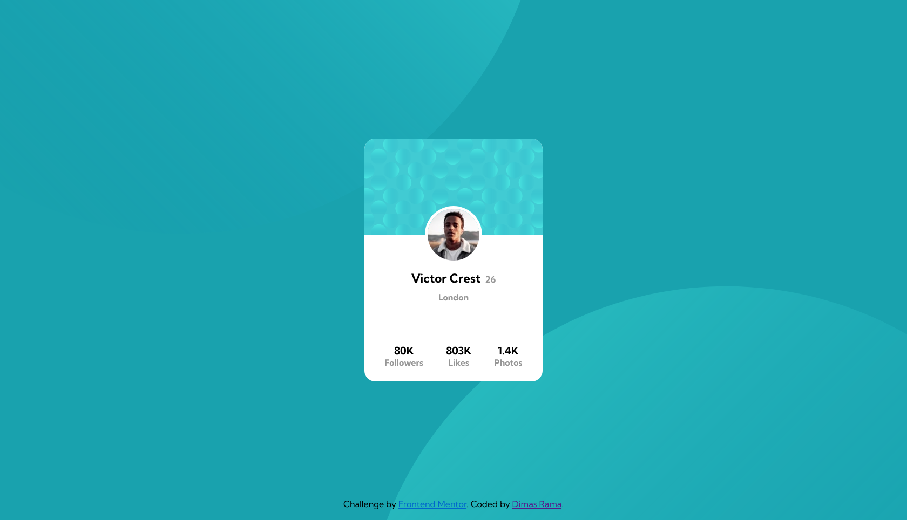
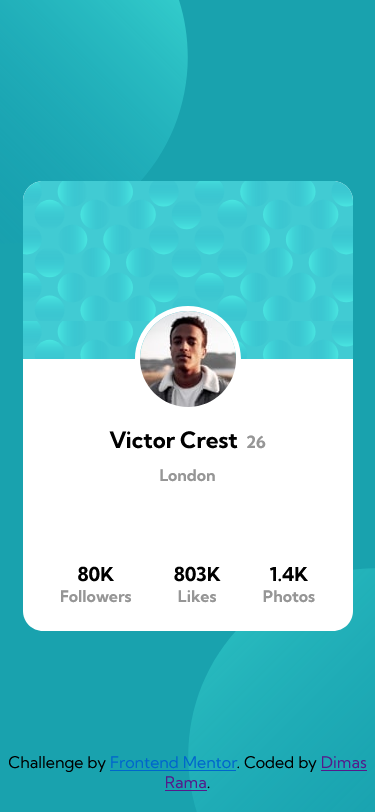

# Frontend Mentor - Profile card component solution

This is a solution to the [Profile card component challenge on Frontend Mentor](https://www.frontendmentor.io/challenges/profile-card-component-cfArpWshJ). Frontend Mentor challenges help you improve your coding skills by building realistic projects.

## Table of contents

- [Overview](#overview)
  - [The challenge](#the-challenge)
  - [Screenshot](#screenshot)
  - [Links](#links)
- [My process](#my-process)
  - [Built with](#built-with)
  - [What I learned](#what-i-learned)
  - [Continued development](#continued-development)
- [Author](#author)

## Overview

### The challenge

- Build out the project to the designs provided

### Screenshot

### Links

- Solution URL: [Solution](https://www.frontendmentor.io/solutions/responsive-and-fluid-card-component-with-html-and-scss-HkMcjwT85)
- Live Site URL: [Live Site](https://ramawib.github.io/profile-card-component-main/)

## My process

### Built with

- Semantic HTML5 markup
- SCSS (variables and mixins)
- Flexbox
- CSS Grid
- Desktop-first workflow

### What I learned

In this challenge, I learned not to underestimate things. I decided to start this challenge as it looks easy enough and said to myself that I can finish this in just 10 minutes. Turns out, it's not as easy as it looks and so this challenge manages to humble myself down. Moreover, now I can see why most developer overestimates their delivery time.

Nonetheless, I learned how to use flex and grid layout on the SCSS. This is the second challenge that I finished from Frontend Mentor. It may not looks as identical as the design especially in the card width and height (since I don't have the Figma file), but I'm happy with the end result 😊.

### Continued development

I've put a row-gap and flex-wrap properties in the #wrapper if someone would like to add multiple card in one page. It can fit up to 8 card (2 rows, 4 columns) on desktop view.

As for mobile view, I haven't code the proper layout for multiple card case (the background isn't expanding and there are still no gap between card).

Nonetheless, the main objective in this challenge has been completed. I may or may not develop the mobile-multiple-card case in the future (maybe I will if it's needed 😴).

## Author

- Website - [Dimas Rama](https://ramawib.github.io)
- Frontend Mentor - [@ramawib](https://www.frontendmentor.io/profile/ramawib)
- Twitter - [@ramawib](https://www.twitter.com/ramawib)
- Instagram - [@ramawib](https://www.instagram.com/ramawib)
